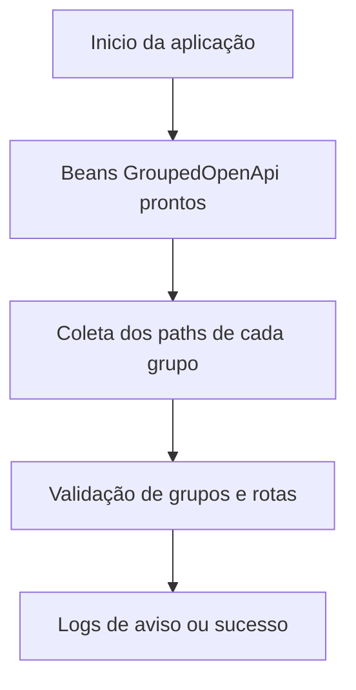

# Configuração de Rotas e Documentação OpenAPI

Este guia explica como a aplicação de exemplo organiza suas rotas REST e como os grupos de documentação OpenAPI são registrados e validados. Todas as classes citadas se encontram em `com.example.praxis.common.config`.

## 1. `ApiRouteDefinitions`

Conjunto centralizado de constantes utilizado por controllers e configurações. Ele define três tipos de valores para cada recurso:

- **PATH** – caminho base do endpoint (ex.: `/api/human-resources/funcionarios`).
- **GROUP** – identificador utilizado para agrupar endpoints no SpringDoc.
- **TAG** – rótulo exibido na interface do Swagger UI.

Exemplo simplificado de uso em uma controller:

```java
@RequestMapping(ApiRouteDefinitions.HR_FUNCIONARIOS_PATH)
@Tag(name = ApiRouteDefinitions.HR_FUNCIONARIOS_TAG)
public class FuncionarioController { ... }
```

Centralizar essas strings evita duplicações e garante consistência na definição das URLs.

## 2. `OpenApiGroupsConfig`

Classe anotada com `@Configuration` que registra vários beans `GroupedOpenApi`. Cada bean define um grupo para o SpringDoc baseado nos valores de `ApiRouteDefinitions`.

```java
@Bean
public GroupedOpenApi configureHrFuncionariosDocumentation() {
    return GroupedOpenApi.builder()
            .group(ApiRouteDefinitions.HR_FUNCIONARIOS_GROUP)
            .pathsToMatch(ApiRouteDefinitions.HR_FUNCIONARIOS_PATH + "/**")
            .build();
}
```

Ao acessar o Swagger UI, cada grupo aparece como uma seção separada. Isso facilita a navegação em APIs grandes e permite gerar documentos segmentados por contexto (por exemplo, HR ou Users).

## 3. `OpenApiGroupsValidator`

Componente auxiliar que implementa `SmartInitializingSingleton`. Após a inicialização do contexto Spring, ele executa diversas verificações:

1. Confere se todos os grupos declarados em `ApiRouteDefinitions` possuem beans correspondentes em `OpenApiGroupsConfig`.
2. Detecta sobreposição de rotas entre diferentes grupos.
3. Emite avisos caso alguma classe `@RestController` não esteja coberta por nenhum grupo.

Fluxo simplificado:



Esses logs auxiliam durante o desenvolvimento para manter a documentação alinhada aos endpoints existentes.

## 4. Adicionando novos grupos

1. **Declare constantes** em `ApiRouteDefinitions` seguindo o padrão `NOME_PATH`, `NOME_GROUP` e `NOME_TAG`.
2. **Crie um bean** em `OpenApiGroupsConfig` registrando o novo grupo com `pathsToMatch` apontando para o caminho definido.
3. **Mapeie sua controller** utilizando `@RequestMapping` com a constante de PATH e `@Tag` com a constante de TAG.
4. Execute a aplicação; o `OpenApiGroupsValidator` indicará nos logs qualquer inconsistência.

Seguindo esses passos, novos endpoints permanecem padronizados e imediatamente documentados no Swagger UI.
