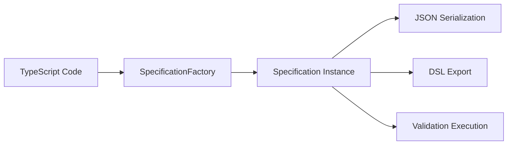
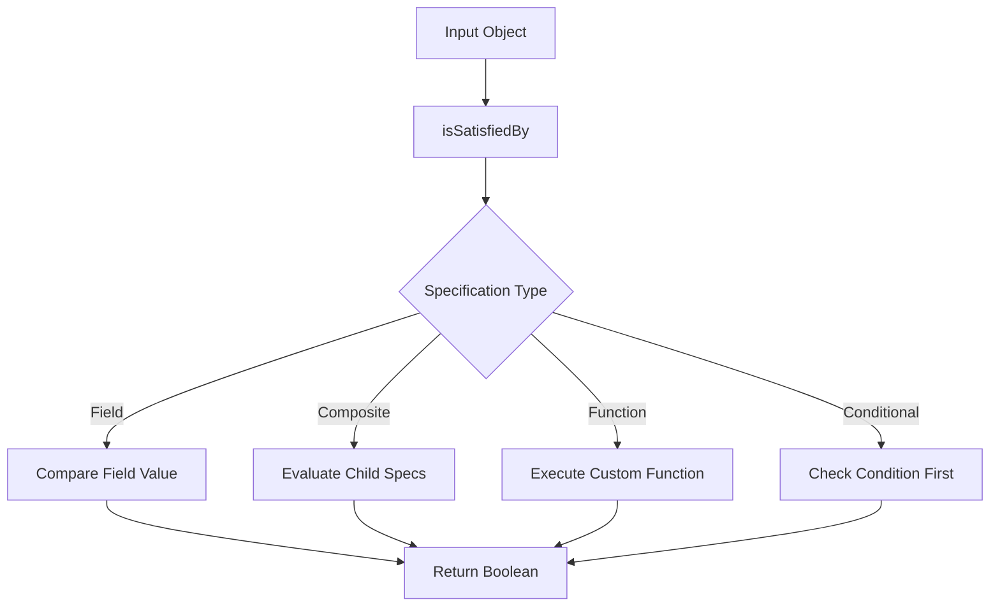

# Architecture Overview

> Understanding the design principles and structure of the Praxis Specification Library

## 🏗️ Core Architecture

The Praxis Specification library follows a **Specification Pattern** with strong emphasis on:

- **Type Safety**: Full TypeScript generics support
- **Composability**: Build complex validations from simple rules
- **Extensibility**: Plugin architecture for custom functions and transforms
- **Serialization**: JSON round-trip support for dynamic validations
- **Human Readability**: DSL export for easy understanding

## 📁 Project Structure

```
praxis-specification/
├── src/lib/
│   ├── specification/              # Core specification classes
│   │   ├── specification.ts        # Abstract base class
│   │   ├── field-specification.ts  # Field comparisons
│   │   ├── and-specification.ts    # Boolean AND composition
│   │   ├── or-specification.ts     # Boolean OR composition
│   │   ├── not-specification.ts    # Boolean NOT composition
│   │   ├── xor-specification.ts    # Boolean XOR composition
│   │   ├── implies-specification.ts # Boolean IMPLIES composition
│   │   ├── function-specification.ts # Custom function calls
│   │   ├── at-least-specification.ts # Cardinality (at least N)
│   │   ├── exactly-specification.ts  # Cardinality (exactly N)
│   │   ├── field-to-field-specification.ts # Field comparisons
│   │   ├── contextual-specification.ts # Dynamic context
│   │   ├── specification-metadata.ts # Metadata interface
│   │   │
│   │   │── Phase 2 Specifications ──
│   │   ├── conditional-validators.ts    # requiredIf, visibleIf, etc.
│   │   ├── collection-specifications.ts # forEach, uniqueBy, etc.
│   │   ├── optional-specifications.ts   # ifDefined, ifNotNull, etc.
│   │   └── form-specification.ts        # Complex form validation
│   │
│   ├── dsl/                        # DSL parsing and export
│   │   ├── token.ts                # Token definitions
│   │   ├── tokenizer.ts            # Lexical analysis
│   │   ├── parser.ts               # Syntax parsing
│   │   ├── exporter.ts             # DSL export
│   │   ├── validation-issue.ts     # Validation error types
│   │   └── dsl-validator.ts        # DSL validation & linting
│   │
│   ├── registry/                   # Extension registries
│   │   ├── function-registry.ts    # Custom function registry
│   │   └── transform-registry.ts   # Transform function registry
│   │
│   ├── context/                    # Dynamic context support
│   │   └── context-provider.ts     # Context resolution
│   │
│   └── utils/                      # Utilities and factories
│       ├── specification-factory.ts # Convenience factory methods
│       └── specification-utils.ts   # Helper utilities
│
├── docs/                           # Documentation
└── examples/                       # Usage examples
```

## 🎯 Design Patterns

### 1. **Specification Pattern**

The core pattern that enables composable validation logic:

```typescript
abstract class Specification<T extends object = any> {
  abstract isSatisfiedBy(obj: T): boolean;
  abstract toJSON(): any;
  abstract toDSL(): string;
  abstract clone(): Specification<T>;
  
  // Metadata support (Phase 2)
  protected metadata?: SpecificationMetadata;
  getMetadata(): SpecificationMetadata | undefined;
}
```

**Benefits:**
- ✅ Single responsibility per specification
- ✅ Easy composition and testing
- ✅ Extensible for new validation types
- ✅ Type-safe generic implementation

### 2. **Composite Pattern**

Boolean compositions (`and`, `or`, `not`, etc.) use the composite pattern:

```typescript
export class AndSpecification<T extends object = any> extends Specification<T> {
  constructor(private specifications: Specification<T>[]) { }
  
  isSatisfiedBy(obj: T): boolean {
    return this.specifications.every(spec => spec.isSatisfiedBy(obj));
  }
}
```

**Benefits:**
- ✅ Treat individual and composite specifications uniformly
- ✅ Build complex validation trees
- ✅ Recursive composition support

### 3. **Factory Pattern**

`SpecificationFactory` provides convenient creation methods:

```typescript
export class SpecificationFactory {
  static equals<T>(field: keyof T, value: any): FieldSpecification<T> {
    return new FieldSpecification<T>(field, ComparisonOperator.EQUALS, value);
  }
  
  static and<T>(...specs: Specification<T>[]): AndSpecification<T> {
    return new AndSpecification<T>(specs);
  }
  
  // Phase 2 methods
  static requiredIf<T>(field: keyof T, condition: Specification<T>): RequiredIfSpecification<T> {
    return new RequiredIfSpecification<T>(field, condition);
  }
}
```

**Benefits:**
- ✅ Simplified API for common scenarios
- ✅ Type inference and safety
- ✅ Consistent creation patterns
- ✅ Reduced boilerplate code

### 4. **Registry Pattern**

Extensible registries for custom functions and transforms:

```typescript
export class FunctionRegistry<T extends object = any> {
  private static instance: FunctionRegistry<any>;
  private functions = new Map<string, ValidationFunction<T>>();
  
  register(name: string, func: ValidationFunction<T>): FunctionRegistry<T> {
    this.functions.set(name, func);
    return this;
  }
  
  execute(name: string, obj: T, ...args: any[]): boolean {
    const func = this.functions.get(name);
    if (!func) {
      throw new Error(`Unknown function: ${name}`);
    }
    return func(obj, ...args);
  }
}
```

**Benefits:**
- ✅ Runtime extensibility
- ✅ Plugin architecture
- ✅ Type-safe function signatures
- ✅ Singleton pattern for global access

## 🔄 Data Flow

### 1. **Specification Creation**



### 2. **Validation Execution**



### 3. **DSL Processing**


## 🧩 Phase Evolution

### **Phase 1: Core Foundation**
- ✅ Basic specification pattern
- ✅ Field comparisons and boolean composition
- ✅ Function and transform registries
- ✅ DSL parsing and export
- ✅ JSON serialization
- ✅ Contextual specifications

### **Phase 2: Advanced Features**
- ✅ **Metadata Support**: Rich validation metadata for UI integration
- ✅ **Conditional Validators**: `requiredIf`, `visibleIf`, `disabledIf`, `readonlyIf`
- ✅ **Collection Validation**: `forEach`, `uniqueBy`, `minLength`, `maxLength`
- ✅ **Optional Field Handling**: `ifDefined`, `ifNotNull`, `ifExists`, `withDefault`
- ✅ **Form Specifications**: Complex form validation scenarios
- ✅ **DSL Validation**: Error detection, suggestions, and linting

## 🎨 Type System Architecture

### Generic Constraints

All specifications use consistent generic constraints:

```typescript
// Base constraint for all specifications
<T extends object = any>

// Collection items also need object constraint
<T extends object = any, TItem extends object = any>
```

### Type Safety Features

```typescript
// Compile-time field validation
SpecificationFactory.equals<User>('name', 'John');  // ✅ Valid
SpecificationFactory.equals<User>('invalid', 'X');  // ❌ Compile error

// Generic type inference
const userSpec = SpecificationFactory.greaterThan<User>('age', 18);
// userSpec is automatically typed as Specification<User>

// Metadata type safety
const metadata: SpecificationMetadata = {
  message: 'Must be an adult',
  code: 'MIN_AGE',
  uiConfig: {
    severity: 'error'  // Type checked against literal union
  }
};
```

## 🔧 Extension Points

### 1. **Custom Specifications**

Create new specification types by extending the base class:

```typescript
export class EmailValidationSpecification<T extends object = any> extends Specification<T> {
  constructor(
    private field: keyof T,
    private options?: EmailValidationOptions,
    metadata?: SpecificationMetadata
  ) {
    super(metadata);
  }
  
  isSatisfiedBy(obj: T): boolean {
    const email = obj[this.field] as string;
    return this.isValidEmail(email);
  }
  
  // Implement required abstract methods
  toJSON(): any { /* ... */ }
  toDSL(): string { /* ... */ }
  clone(): EmailValidationSpecification<T> { /* ... */ }
}
```

### 2. **Custom Functions**

Register domain-specific validation functions:

```typescript
FunctionRegistry.getInstance<User>()
  .register('isValidCPF', (user: User, field: string) => {
    return validateCPF(user[field]);
  })
  .register('hasPermission', (user: User, permission: string) => {
    return user.permissions.includes(permission);
  });
```

### 3. **Custom Transforms**

Add data transformation capabilities:

```typescript
TransformRegistry.getInstance()
  .register('normalize', (value: string) => {
    return value.trim().toLowerCase();
  })
  .register('removeAccents', (value: string) => {
    return value.normalize('NFD').replace(/[\u0300-\u036f]/g, '');
  });
```

## 📊 Performance Considerations

### **Optimization Strategies**

1. **Lazy Evaluation**: Specifications are evaluated only when needed
2. **Short-Circuit Logic**: Boolean compositions stop early when possible
3. **Immutable Design**: Specifications are immutable, enabling safe caching
4. **Type Erasure**: Runtime overhead is minimal due to TypeScript compilation

### **Memory Management**

- Specifications are lightweight objects
- Factory methods create new instances (immutable)
- Registry patterns use singleton instances
- Clone methods create deep copies when needed

### **Best Practices**

```typescript
// ✅ Good: Reuse specifications
const ageValidation = SpecificationFactory.greaterThan('age', 18);
const emailValidation = SpecificationFactory.contains('email', '@');
const userSpec = SpecificationFactory.and(ageValidation, emailValidation);

// ❌ Avoid: Creating specifications in tight loops
users.forEach(user => {
  const spec = SpecificationFactory.greaterThan('age', 18); // Bad!
  return spec.isSatisfiedBy(user);
});

// ✅ Good: Create once, reuse many times
const ageSpec = SpecificationFactory.greaterThan('age', 18);
users.forEach(user => ageSpec.isSatisfiedBy(user));
```

## 🔮 Future Roadmap

### **Phase 3: Planned Features**
- 🎯 **Async Specifications**: Support for async validation
- 🌐 **i18n Support**: Internationalization for error messages
- 📱 **Mobile Optimizations**: Reduced bundle size for mobile apps
- 🔌 **Plugin Ecosystem**: Official plugin architecture
- 📈 **Performance Analytics**: Built-in performance monitoring
- 🎨 **Visual Designer**: UI for building validations
- 🔄 **Real-time Validation**: WebSocket-based validation updates

### **Integration Targets**
- ✅ Angular Reactive Forms (Current)
- 🎯 React Hook Form
- 🎯 Vue.js Composition API
- 🎯 Svelte Stores
- 🎯 Node.js Server Validation

---

This architecture provides a solid foundation for building complex, maintainable validation systems while maintaining excellent developer experience and runtime performance.