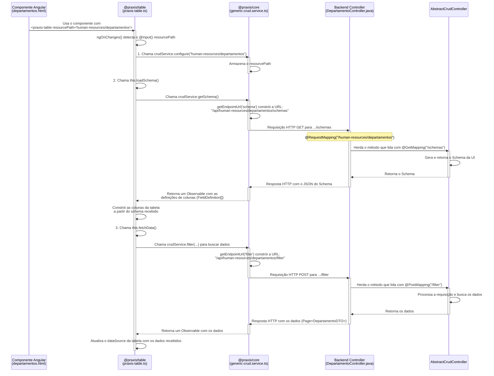
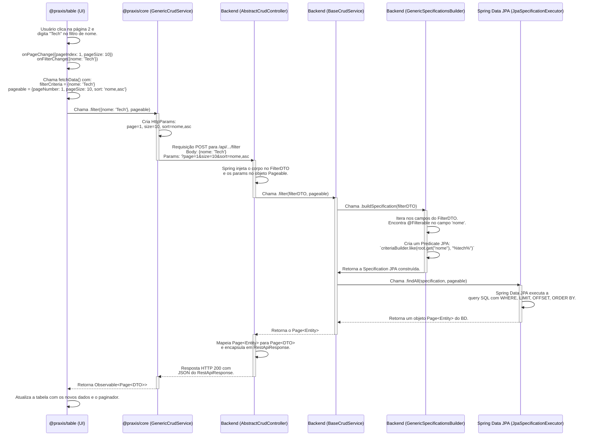

# @praxis/table

> Componente de tabela empresarial avançado com arquitetura unificada

## 🌟 Visão Geral

A biblioteca `@praxis/table` fornece um componente de tabela robusto e altamente configurável para aplicações Angular empresariais. Com a nova arquitetura unificada, oferece uma experiência de desenvolvimento simplificada mantendo todos os recursos avançados.

## ✨ Características Principais

### 🏗️ Arquitetura Unificada

- **Interface única**: `TableConfig` consolidada
- **Type Safety**: Tipagem forte em toda a API
- **Performance otimizada**: Eliminação de overhead de adaptação
- **API simplificada**: Menos confusão, mais produtividade

### 📊 Recursos Avançados

- **Paginação inteligente**: Client-side e server-side
- **Ordenação múltipla**: Suporte a multi-sort
- **Filtros dinâmicos**: Global e por coluna
- **Seleção de linhas**: Single, multiple e bulk actions
- **Redimensionamento**: Colunas redimensionáveis
- **Virtualização**: Para grandes volumes de dados
- **Exportação**: CSV, Excel, PDF
- **Acessibilidade**: WCAG 2.1 AA compliant

### 🎨 Editores Visuais

- **Behavior Editor**: Configuração de comportamentos
- **Columns Editor**: Gestão avançada de colunas
- **Toolbar Editor**: Personalização de ações
- **Messages Editor**: Textos e localização

## 🚀 Instalação

```bash
npm install @praxis/core @praxis/table
```

## 📝 Uso Básico

### Conectando ao Backend com `resourcePath`

A forma mais poderosa de usar a `<praxis-table>` é conectá-la diretamente a um endpoint de API compatível com o ecossistema Praxis. Isso é feito através do input `resourcePath`.

Quando `resourcePath` é fornecido, a tabela se torna "inteligente":

1.  **Busca automática de dados**: A tabela gerencia a paginação, ordenação e filtros, fazendo as requisições necessárias ao backend.
2.  **Geração dinâmica de colunas**: A tabela busca os metadados (schema) do backend para gerar as colunas automaticamente, respeitando as configurações definidas no `praxis-metadata-core` (via anotação `@UISchema`).

```html
<!-- Exemplo no template do seu componente -->
<praxis-table resourcePath="human-resources/departamentos" [editModeEnabled]="true"> </praxis-table>
```

Neste exemplo:

- `resourcePath="human-resources/departamentos"` instrui a tabela a se comunicar com o endpoint `/api/human-resources/departamentos`.
- A tabela fará requisições como `POST /api/human-resources/departamentos/filter` para obter os dados e `GET /api/human-resources/departamentos/schemas` para obter a configuração das colunas.
- `[editModeEnabled]="true"` permite a edição visual da configuração da tabela em tempo real.

### Fluxo de Comunicação do `resourcePath`

O diagrama abaixo ilustra como a propriedade `resourcePath` conecta o componente frontend ao controller do backend. O fluxo de inicialização ocorre em três etapas principais: **Configurar**, **Carregar Schema** e **Buscar Dados**.



### Uso com Dados Locais (Client-Side)

Se você precisar fornecer os dados manualmente (por exemplo, de uma fonte que não é uma API Praxis), pode usar o input `[data]` e omitir o `resourcePath`. Neste modo, todas as operações (paginação, ordenação, filtro) são realizadas no lado do cliente.

```typescript
import { PraxisTable } from "@praxis/table";
import { TableConfig } from "@praxis/core";

@Component({
  selector: "app-example",
  standalone: true,
  imports: [PraxisTable],
  template: ` <praxis-table [config]="tableConfig" [data]="employees"> </praxis-table> `,
})
export class ExampleComponent {
  // Configuração de colunas e comportamento é obrigatória neste modo
  tableConfig: TableConfig = {
    columns: [
      { field: "id", header: "ID", type: "number" },
      { field: "name", header: "Nome", type: "string" },
      { field: "email", header: "Email", type: "string" },
    ],
    behavior: {
      pagination: { enabled: true, pageSize: 10 },
      sorting: { enabled: true },
      filtering: { enabled: true, globalFilter: { enabled: true } },
    },
  };

  employees = [
    { id: 1, name: "João Silva", email: "joao@empresa.com" },
    { id: 2, name: "Maria Santos", email: "maria@empresa.com" },
    // ... mais dados
  ];
}
```

## ⚙️ Fluxo de Paginação e Filtros (Server-Side)

Quando a `<praxis-table>` é conectada a um `resourcePath`, as operações de paginação, ordenação e filtro são delegadas ao backend. Isso garante alta performance, pois apenas os dados visíveis na tela são trafegados pela rede.

O diagrama abaixo detalha a sequência de eventos, desde a interação do usuário na UI até a construção da consulta JPA no servidor.



### Pontos-Chave do Fluxo:

1.  **UI (`@praxis/table`)**: Captura eventos do usuário e os traduz em objetos `filterCriteria` e `pageable`.
2.  **Serviço Frontend (`@praxis/core`)**: O `GenericCrudService` serializa o `pageable` como parâmetros de URL e o `filterCriteria` como corpo de uma requisição POST.
3.  **Controller Backend**: O `AbstractCrudController` recebe a requisição. O Spring Boot automaticamente popula o DTO de filtro com o corpo da requisição e o objeto `Pageable` com os parâmetros da URL.
4.  **Serviço Backend (`praxis-metadata-core`)**: O `GenericSpecificationsBuilder` inspeciona as anotações `@Filterable` no DTO de filtro para construir uma `Specification` JPA dinâmica.
5.  **Repositório (Spring Data JPA)**: O `JpaSpecificationExecutor` (geralmente estendido pelo seu repositório) usa a `Specification` e o `Pageable` para gerar e executar a consulta SQL final, otimizada para o banco de dados.

## 🎨 Edição Visual da Tabela: O Poder do Low-Code

A `<praxis-table>` vem com um poderoso editor de configuração visual que permite personalizar quase todos os aspectos da sua tabela em tempo real, sem escrever uma única linha de código. Ative o editor passando a propriedade `[editModeEnabled]="true"` para o componente.

A seguir, veja os principais recursos que você pode configurar visualmente:

### 1. Gerenciamento de Colunas

Controle total sobre as colunas da sua tabela. Dentro do editor, você pode:

- **Reordenar com Arrastar e Soltar:** Simplesmente clique e arraste uma coluna para a posição desejada.
- **Alterar Visibilidade:** Use a caixa de seleção ao lado de cada coluna para mostrá-la ou ocultá-la instantaneamente.
- **Editar Títulos e Largura:** Clique em uma coluna para abrir suas propriedades e altere o texto do cabeçalho, defina uma largura fixa (ex: `150px`) ou deixe-a automática.

### 2. Transformação de Dados Sem Código

Converta dados brutos em informações claras e formatadas para o usuário.

- **Formatação Automática:** Selecione uma coluna e escolha seu "Tipo de Dado". Se escolher `Moeda`, os valores serão formatados como `R$ 1.234,56`. Se escolher `Data`, você pode selecionar formatos como `dd/MM/yyyy` ou `25 de janeiro de 2025`.
- **Mapeamento de Valores:** Transforme códigos e valores brutos em texto legível. Na seção "Mapeamento de Valores", você pode definir visualmente que o valor `true` deve ser exibido como "Ativo" e `false` como "Inativo", ou que o código `1` significa "Pendente" e `2` significa "Aprovado".

### 3. Colunas Calculadas com Fórmulas Visuais

Crie novas colunas dinamicamente a partir de dados existentes, sem precisar programar.

- **Concatenar Texto:** Crie uma "Coluna Calculada", escolha a fórmula "Concatenar" e selecione os campos `nome` e `sobrenome` para criar uma coluna "Nome Completo".
- **Realizar Operações Matemáticas:** Use a fórmula "Operação Matemática" para criar uma coluna que calcula `preço * quantidade`.
- **Criar Valores Condicionais (IF/ELSE):** Com a fórmula "Condicional", você pode criar uma coluna "Nível de Risco" que exibe "Alto" se o `valor` for maior que 1000, e "Baixo" caso contrário.

### 4. Formatação Condicional (Regras de Estilo)

Destaque informações importantes aplicando estilos que mudam com base nos dados da linha.

- **Crie Regras Visuais:** Na seção de "Formatação Condicional", crie uma nova regra.
- **Defina a Condição:** Estabeleça a condição, por exemplo: "Quando a coluna `status` tiver o valor igual a 'Urgente'".
- **Aplique o Estilo:** Use seletores de cor para definir que, quando a condição for verdadeira, a cor de fundo da célula ou da linha inteira deve se tornar vermelha e o texto, branco.

### 5. Comportamentos da Tabela

Habilite e configure as funcionalidades centrais da tabela com um clique. Na aba "Comportamento", você pode:

- **Ativar/Desativar Paginação:** Com um único interruptor, ative a paginação para tabelas com muitos dados e defina quantos itens exibir por página.
- **Controlar Ordenação e Filtros:** Habilite a capacidade dos usuários de ordenar colunas e filtrar os dados com simples caixas de seleção.
- **Gerenciar Seleção de Linhas:** Permita que os usuários selecionem uma ou várias linhas para realizar ações em lote.

### Editores Especializados

#### Behavior Editor

```typescript
import { BehaviorConfigEditorComponent } from '@praxis/table';

// Usar como componente standalone para edição específica
<behavior-config-editor
  [config]="tableConfig"
  (configChange)="onBehaviorChange($event)">
</behavior-config-editor>
```

#### Columns Editor

```typescript
import { ColumnsConfigEditorComponent } from '@praxis/table';

<columns-config-editor
  [config]="tableConfig"
  (configChange)="onColumnsChange($event)"
  (columnChange)="onColumnChange($event)">
</columns-config-editor>
```

## 🔧 Configuração Avançada

### Performance com Virtualização

```typescript
const highVolumeConfig: TableConfig = {
  columns: [...],
  performance: {
    virtualization: {
      enabled: true,
      itemHeight: 48,
      bufferSize: 10,
      minContainerHeight: 400,
      strategy: 'fixed'
    },
    lazyLoading: {
      threshold: 100,
      images: true,
      components: true
    }
  }
};
```

### Acessibilidade Personalizada

```typescript
const accessibleConfig: TableConfig = {
  columns: [...],
  accessibility: {
    enabled: true,
    announcements: {
      dataChanges: true,
      userActions: true,
      loadingStates: true,
      liveRegion: 'polite'
    },
    keyboard: {
      shortcuts: true,
      tabNavigation: true,
      arrowNavigation: true,
      skipLinks: true,
      focusTrap: false
    },
    highContrast: false,
    reduceMotion: false
  }
};
```

### Aparência Customizada

```typescript
const styledConfig: TableConfig = {
  columns: [...],
  appearance: {
    density: 'compact',
    borders: {
      showRowBorders: true,
      showColumnBorders: false,
      showOuterBorder: true,
      style: 'solid',
      width: 1,
      color: '#e0e0e0'
    },
    elevation: {
      level: 2,
      shadowColor: 'rgba(0, 0, 0, 0.1)'
    },
    spacing: {
      cellPadding: '8px 16px',
      headerPadding: '12px 16px'
    },
    typography: {
      fontWeight: '400',
      fontSize: '14px',
      headerFontWeight: '500',
      headerFontSize: '14px'
    }
  }
};
```

## 🎯 Event Handling

### Eventos da Tabela

```typescript
<praxis-table
  [config]="tableConfig"
  [data]="data"
  (rowClick)="onRowClick($event)"
  (rowSelect)="onRowSelect($event)"
  (bulkAction)="onBulkAction($event)"
  (configChange)="onConfigChange($event)"
  (dataFilter)="onDataFilter($event)"
  (dataSort)="onDataSort($event)"
  (pageChange)="onPageChange($event)">
</praxis-table>
```

### Implementação dos Handlers

```typescript
export class MyComponent {
  onRowClick(event: { row: any; index: number }) {
    console.log("Row clicked:", event.row);
  }

  onRowSelect(event: { selectedRows: any[]; isSelectAll: boolean }) {
    console.log("Selection changed:", event.selectedRows);
  }

  onBulkAction(event: { action: string; selectedRows: any[] }) {
    switch (event.action) {
      case "deleteSelected":
        this.deleteMultiple(event.selectedRows);
        break;
      // Handle other bulk actions
    }
  }

  onConfigChange(newConfig: TableConfig) {
    this.tableConfig = newConfig;
  }
}
```

## 🛠️ Utilitários e Helpers

### Helper Functions

```typescript
import { createDefaultTableConfig, isValidTableConfig, cloneTableConfig, mergeTableConfigs } from "@praxis/core";

// Criar configuração padrão
const defaultConfig = createDefaultTableConfig();

// Validar configuração
if (isValidTableConfig(myConfig)) {
  // Configuração válida
}

// Clonar configuração
const clonedConfig = cloneTableConfig(originalConfig);

// Merge configurações
const mergedConfig = mergeTableConfigs(baseConfig, overrides);
```

### Service Integration

```typescript
import { TableConfigService } from '@praxis/core';

@Component({...})
export class MyComponent {
  constructor(private configService: TableConfigService) {}

  ngOnInit() {
    // Usar serviço para gerenciar configuração
    this.configService.setConfig(this.tableConfig);

    // Verificar recursos disponíveis
    const hasMultiSort = this.configService.isFeatureEnabled('multiSort');
    const hasBulkActions = this.configService.isFeatureEnabled('bulkActions');
  }
}
```

## 🧪 Testes

### Unit Tests

```typescript
import { ComponentFixture, TestBed } from "@angular/core/testing";
import { PraxisTable } from "@praxis/table";
import { TableConfig } from "@praxis/core";

describe("PraxisTable", () => {
  let component: PraxisTable;
  let fixture: ComponentFixture<PraxisTable>;

  beforeEach(() => {
    TestBed.configureTestingModule({
      imports: [PraxisTable],
    });

    fixture = TestBed.createComponent(PraxisTable);
    component = fixture.componentInstance;
  });

  it("should create", () => {
    expect(component).toBeTruthy();
  });

  it("should handle configuration changes", () => {
    const config: TableConfig = {
      columns: [{ field: "test", header: "Test" }],
    };

    component.config = config;
    fixture.detectChanges();

    expect(component.config).toEqual(config);
  });
});
```

## 📋 Migration Guide

### Migração da Arquitetura V1/V2

Se você estava usando as versões anteriores com dual architecture, aqui estão as principais mudanças:

#### Imports Atualizados

```typescript
// Antes
import { TableConfigV1, TableConfigV2, TableConfigUnified } from "@praxis/core";

// Depois
import { TableConfig } from "@praxis/core";
```

#### Serviços Removidos

```typescript
// Antes
import { TableConfigAdapterService } from "@praxis/table";

// Depois - Não mais necessário
// Uso direto da configuração
```

#### Tipos Simplificados

```typescript
// Antes
config: TableConfigUnified;

// Depois
config: TableConfig;
```

### Breaking Changes

1. **TableConfigAdapterService**: Removido - uso direto da configuração
2. **TableConfigMigrationService**: Simplificado - funcionalidade integrada
3. **TableConfigUnified**: Renomeado para `TableConfig`

## 🔍 Troubleshooting

### Problemas Comuns

#### Configuração não está funcionando

```typescript
// Verificar se a configuração é válida
import { isValidTableConfig } from "@praxis/core";

if (!isValidTableConfig(myConfig)) {
  console.error("Configuração inválida:", myConfig);
}
```

#### Performance Issues

```typescript
// Habilitar virtualização para grandes datasets
const config: TableConfig = {
  // ...
  performance: {
    virtualization: {
      enabled: true,
      itemHeight: 48,
      bufferSize: 20,
    },
  },
};
```

#### Acessibilidade

```typescript
// Garantir que acessibilidade está habilitada
const config: TableConfig = {
  // ...
  accessibility: {
    enabled: true,
    announcements: { dataChanges: true, userActions: true, loadingStates: true, liveRegion: "polite" },
  },
};
```

## 📚 API Reference

### Interfaces Principais

#### TableConfig

Interface principal para configuração da tabela.

#### ColumnDefinition

Define configuração individual de colunas.

#### TableBehaviorConfig

Configurações de comportamento (paginação, ordenação, etc.).

#### TableAppearanceConfig

Configurações de aparência visual.

Para documentação completa da API, consulte a [documentação da @praxis/core](../praxis-core/README.md).

## 🤝 Contribuição

### Como Contribuir

1. Fork o projeto
2. Crie branch para feature (`git checkout -b feature/nova-funcionalidade`)
3. Commit mudanças (`git commit -m 'Add: nova funcionalidade'`)
4. Push para branch (`git push origin feature/nova-funcionalidade`)
5. Abra Pull Request

### Guidelines

- Seguir Angular Style Guide
- Adicionar testes para novas features
- Manter documentação atualizada
- Usar TypeScript strict mode

## 🔍 Exemplo de Integração com PraxisFilter

O `PraxisFilter` pode ser acoplado à barra de ferramentas da tabela. O exemplo abaixo mostra a busca de pessoas por CPF e status.

```html
<praxis-filter [resourcePath]="'pessoas'" [formId]="'pessoas-filter'" [persistenceKey]="'pessoas-filter-v1'" [quickField]="'cpf'" [alwaysVisibleFields]="['status']" (submit)="onFilter($event)"></praxis-filter> <praxis-table [data]="tableData"></praxis-table>
```

```ts
onFilter(dto: any) {
  this.crud.configure('pessoas', ApiEndpoint.HumanResources);
  this.crud.filter(dto, this.pageable).subscribe(page => {
    this.tableData = page.content;
  });
}
```

## 📊 Roadmap

### Próximas Versões

- ✅ Arquitetura unificada (v2.0.0)
- 🔄 Enhanced mobile support (v2.1.0)
- 📋 Advanced export options (v2.2.0)
- 🎨 Theme customization (v2.3.0)

## 📄 Licença

MIT License - consulte [LICENSE](../../LICENSE) para detalhes.

---

**Parte do Praxis UI Workspace**
**Versão**: 2.0.0 (Unified Architecture)
**Compatibilidade**: Angular 18+
