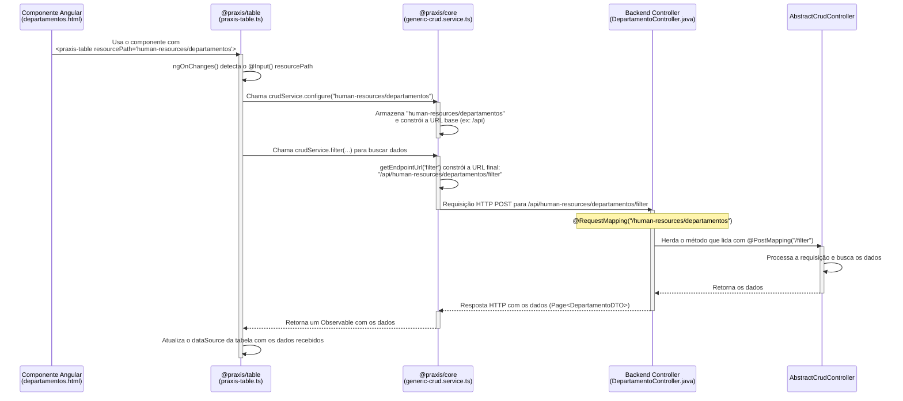

# @praxis/table

> Componente de tabela empresarial avançado com arquitetura unificada

## 🌟 Visão Geral

A biblioteca `@praxis/table` fornece um componente de tabela robusto e altamente configurável para aplicações Angular empresariais. Com a nova arquitetura unificada, oferece uma experiência de desenvolvimento simplificada mantendo todos os recursos avançados.

## ✨ Características Principais

### 🏗️ Arquitetura Unificada
- **Interface única**: `TableConfig` consolidada
- **Type Safety**: Tipagem forte em toda a API
- **Performance otimizada**: Eliminação de overhead de adaptação
- **API simplificada**: Menos confusão, mais produtividade

### 📊 Recursos Avançados
- **Paginação inteligente**: Client-side e server-side
- **Ordenação múltipla**: Suporte a multi-sort
- **Filtros dinâmicos**: Global e por coluna
- **Seleção de linhas**: Single, multiple e bulk actions
- **Redimensionamento**: Colunas redimensionáveis
- **Virtualização**: Para grandes volumes de dados
- **Exportação**: CSV, Excel, PDF
- **Acessibilidade**: WCAG 2.1 AA compliant

### 🎨 Editores Visuais
- **Behavior Editor**: Configuração de comportamentos
- **Columns Editor**: Gestão avançada de colunas
- **Toolbar Editor**: Personalização de ações
- **Messages Editor**: Textos e localização

## 🚀 Instalação

```bash
npm install @praxis/core @praxis/table
```

## 📝 Uso Básico

### Conectando ao Backend com `resourcePath`

A forma mais poderosa de usar a `<praxis-table>` é conectá-la diretamente a um endpoint de API compatível com o ecossistema Praxis. Isso é feito através do input `resourcePath`.

Quando `resourcePath` é fornecido, a tabela se torna "inteligente":
1.  **Busca automática de dados**: A tabela gerencia a paginação, ordenação e filtros, fazendo as requisições necessárias ao backend.
2.  **Geração dinâmica de colunas**: A tabela busca os metadados (schema) do backend para gerar as colunas automaticamente, respeitando as configurações definidas no `praxis-metadata-core` (via anotação `@UISchema`).

```html
<!-- Exemplo no template do seu componente -->
<praxis-table
  resourcePath="human-resources/departamentos"
  [editModeEnabled]="true">
</praxis-table>
```

Neste exemplo:
- `resourcePath="human-resources/departamentos"` instrui a tabela a se comunicar com o endpoint `/api/human-resources/departamentos`.
- A tabela fará requisições como `POST /api/human-resources/departamentos/filter` para obter os dados e `GET /api/human-resources/departamentos/schemas` para obter a configuração das colunas.
- `[editModeEnabled]="true"` permite a edição visual da configuração da tabela em tempo real.

### Fluxo de Comunicação do `resourcePath`

O diagrama abaixo ilustra como a propriedade `resourcePath` conecta o componente frontend ao controller do backend.



### Uso com Dados Locais (Client-Side)

Se você precisar fornecer os dados manualmente (por exemplo, de uma fonte que não é uma API Praxis), pode usar o input `[data]` e omitir o `resourcePath`. Neste modo, todas as operações (paginação, ordenação, filtro) são realizadas no lado do cliente.

```typescript
import { PraxisTable } from '@praxis/table';
import { TableConfig } from '@praxis/core';

@Component({
  selector: 'app-example',
  standalone: true,
  imports: [PraxisTable],
  template: `
    <praxis-table 
      [config]="tableConfig"
      [data]="employees">
    </praxis-table>
  `
})
export class ExampleComponent {
  // Configuração de colunas e comportamento é obrigatória neste modo
  tableConfig: TableConfig = {
    columns: [
      { field: 'id', header: 'ID', type: 'number' },
      { field: 'name', header: 'Nome', type: 'string' },
      { field: 'email', header: 'Email', type: 'string' },
    ],
    behavior: {
      pagination: { enabled: true, pageSize: 10 },
      sorting: { enabled: true },
      filtering: { enabled: true, globalFilter: { enabled: true } }
    }
  };

  employees = [
    { id: 1, name: 'João Silva', email: 'joao@empresa.com' },
    { id: 2, name: 'Maria Santos', email: 'maria@empresa.com' },
    // ... mais dados
  ];
}
```

## 🎛️ Editor de Configuração

### Abrindo o Editor Visual
```typescript
import { MatDialog } from '@angular/material/dialog';
import { PraxisTableConfigEditor } from '@praxis/table';

@Component({
  // ...
})
export class MyComponent {
  constructor(private dialog: MatDialog) {}

  openConfigEditor() {
    const dialogRef = this.dialog.open(PraxisTableConfigEditor, {
      data: { config: this.tableConfig },
      width: '90vw',
      height: '90vh',
      panelClass: 'config-editor-dialog'
    });

    dialogRef.afterClosed().subscribe(result => {
      if (result) {
        this.tableConfig = result;
        console.log('Nova configuração:', result);
      }
    });
  }
}
```

### Editores Especializados

#### Behavior Editor
```typescript
import { BehaviorConfigEditorComponent } from '@praxis/table';

// Usar como componente standalone para edição específica
<behavior-config-editor
  [config]="tableConfig"
  (configChange)="onBehaviorChange($event)">
</behavior-config-editor>
```

#### Columns Editor
```typescript
import { ColumnsConfigEditorComponent } from '@praxis/table';

<columns-config-editor
  [config]="tableConfig"
  (configChange)="onColumnsChange($event)"
  (columnChange)="onColumnChange($event)">
</columns-config-editor>
```

## 🔧 Configuração Avançada

### Performance com Virtualização
```typescript
const highVolumeConfig: TableConfig = {
  columns: [...],
  performance: {
    virtualization: {
      enabled: true,
      itemHeight: 48,
      bufferSize: 10,
      minContainerHeight: 400,
      strategy: 'fixed'
    },
    lazyLoading: {
      threshold: 100,
      images: true,
      components: true
    }
  }
};
```

### Acessibilidade Personalizada
```typescript
const accessibleConfig: TableConfig = {
  columns: [...],
  accessibility: {
    enabled: true,
    announcements: {
      dataChanges: true,
      userActions: true,
      loadingStates: true,
      liveRegion: 'polite'
    },
    keyboard: {
      shortcuts: true,
      tabNavigation: true,
      arrowNavigation: true,
      skipLinks: true,
      focusTrap: false
    },
    highContrast: false,
    reduceMotion: false
  }
};
```

### Aparência Customizada
```typescript
const styledConfig: TableConfig = {
  columns: [...],
  appearance: {
    density: 'compact',
    borders: {
      showRowBorders: true,
      showColumnBorders: false,
      showOuterBorder: true,
      style: 'solid',
      width: 1,
      color: '#e0e0e0'
    },
    elevation: {
      level: 2,
      shadowColor: 'rgba(0, 0, 0, 0.1)'
    },
    spacing: {
      cellPadding: '8px 16px',
      headerPadding: '12px 16px'
    },
    typography: {
      fontWeight: '400',
      fontSize: '14px',
      headerFontWeight: '500',
      headerFontSize: '14px'
    }
  }
};
```

## 🎯 Event Handling

### Eventos da Tabela
```typescript
<praxis-table
  [config]="tableConfig"
  [data]="data"
  (rowClick)="onRowClick($event)"
  (rowSelect)="onRowSelect($event)"
  (bulkAction)="onBulkAction($event)"
  (configChange)="onConfigChange($event)"
  (dataFilter)="onDataFilter($event)"
  (dataSort)="onDataSort($event)"
  (pageChange)="onPageChange($event)">
</praxis-table>
```

### Implementação dos Handlers
```typescript
export class MyComponent {
  onRowClick(event: { row: any, index: number }) {
    console.log('Row clicked:', event.row);
  }

  onRowSelect(event: { selectedRows: any[], isSelectAll: boolean }) {
    console.log('Selection changed:', event.selectedRows);
  }

  onBulkAction(event: { action: string, selectedRows: any[] }) {
    switch (event.action) {
      case 'deleteSelected':
        this.deleteMultiple(event.selectedRows);
        break;
      // Handle other bulk actions
    }
  }

  onConfigChange(newConfig: TableConfig) {
    this.tableConfig = newConfig;
  }
}
```

## 🛠️ Utilitários e Helpers

### Helper Functions
```typescript
import { 
  createDefaultTableConfig,
  isValidTableConfig,
  cloneTableConfig,
  mergeTableConfigs
} from '@praxis/core';

// Criar configuração padrão
const defaultConfig = createDefaultTableConfig();

// Validar configuração
if (isValidTableConfig(myConfig)) {
  // Configuração válida
}

// Clonar configuração
const clonedConfig = cloneTableConfig(originalConfig);

// Merge configurações
const mergedConfig = mergeTableConfigs(baseConfig, overrides);
```

### Service Integration
```typescript
import { TableConfigService } from '@praxis/core';

@Component({...})
export class MyComponent {
  constructor(private configService: TableConfigService) {}

  ngOnInit() {
    // Usar serviço para gerenciar configuração
    this.configService.setConfig(this.tableConfig);
    
    // Verificar recursos disponíveis
    const hasMultiSort = this.configService.isFeatureEnabled('multiSort');
    const hasBulkActions = this.configService.isFeatureEnabled('bulkActions');
  }
}
```

## 🧪 Testes

### Unit Tests
```typescript
import { ComponentFixture, TestBed } from '@angular/core/testing';
import { PraxisTable } from '@praxis/table';
import { TableConfig } from '@praxis/core';

describe('PraxisTable', () => {
  let component: PraxisTable;
  let fixture: ComponentFixture<PraxisTable>;

  beforeEach(() => {
    TestBed.configureTestingModule({
      imports: [PraxisTable]
    });
    
    fixture = TestBed.createComponent(PraxisTable);
    component = fixture.componentInstance;
  });

  it('should create', () => {
    expect(component).toBeTruthy();
  });

  it('should handle configuration changes', () => {
    const config: TableConfig = {
      columns: [{ field: 'test', header: 'Test' }]
    };
    
    component.config = config;
    fixture.detectChanges();
    
    expect(component.config).toEqual(config);
  });
});
```

## 📋 Migration Guide

### Migração da Arquitetura V1/V2

Se você estava usando as versões anteriores com dual architecture, aqui estão as principais mudanças:

#### Imports Atualizados
```typescript
// Antes
import { TableConfigV1, TableConfigV2, TableConfigUnified } from '@praxis/core';

// Depois  
import { TableConfig } from '@praxis/core';
```

#### Serviços Removidos
```typescript
// Antes
import { TableConfigAdapterService } from '@praxis/table';

// Depois - Não mais necessário
// Uso direto da configuração
```

#### Tipos Simplificados
```typescript
// Antes
config: TableConfigUnified;

// Depois
config: TableConfig;
```

### Breaking Changes

1. **TableConfigAdapterService**: Removido - uso direto da configuração
2. **TableConfigMigrationService**: Simplificado - funcionalidade integrada
3. **TableConfigUnified**: Renomeado para `TableConfig`

## 🔍 Troubleshooting

### Problemas Comuns

#### Configuração não está funcionando
```typescript
// Verificar se a configuração é válida
import { isValidTableConfig } from '@praxis/core';

if (!isValidTableConfig(myConfig)) {
  console.error('Configuração inválida:', myConfig);
}
```

#### Performance Issues
```typescript
// Habilitar virtualização para grandes datasets
const config: TableConfig = {
  // ...
  performance: {
    virtualization: {
      enabled: true,
      itemHeight: 48,
      bufferSize: 20
    }
  }
};
```

#### Acessibilidade
```typescript
// Garantir que acessibilidade está habilitada
const config: TableConfig = {
  // ...
  accessibility: {
    enabled: true,
    announcements: { dataChanges: true, userActions: true, loadingStates: true, liveRegion: 'polite' }
  }
};
```

## 📚 API Reference

### Interfaces Principais

#### TableConfig
Interface principal para configuração da tabela.

#### ColumnDefinition
Define configuração individual de colunas.

#### TableBehaviorConfig
Configurações de comportamento (paginação, ordenação, etc.).

#### TableAppearanceConfig
Configurações de aparência visual.

Para documentação completa da API, consulte a [documentação da @praxis/core](../praxis-core/README.md).

## 🤝 Contribuição

### Como Contribuir
1. Fork o projeto
2. Crie branch para feature (`git checkout -b feature/nova-funcionalidade`)
3. Commit mudanças (`git commit -m 'Add: nova funcionalidade'`)
4. Push para branch (`git push origin feature/nova-funcionalidade`)
5. Abra Pull Request

### Guidelines
- Seguir Angular Style Guide
- Adicionar testes para novas features
- Manter documentação atualizada
- Usar TypeScript strict mode

## 📊 Roadmap

### Próximas Versões
- ✅ Arquitetura unificada (v2.0.0)
- 🔄 Enhanced mobile support (v2.1.0)
- 📋 Advanced export options (v2.2.0)
- 🎨 Theme customization (v2.3.0)

## 📄 Licença

MIT License - consulte [LICENSE](../../LICENSE) para detalhes.

---

**Parte do Praxis UI Workspace**  
**Versão**: 2.0.0 (Unified Architecture)  
**Compatibilidade**: Angular 18+